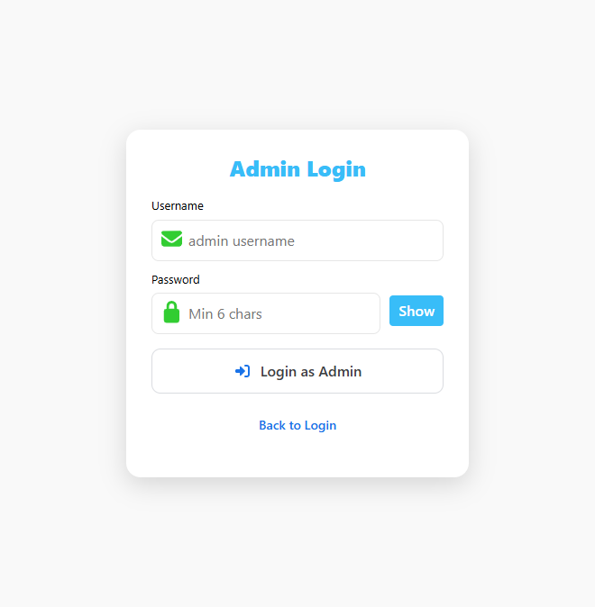

# CuraAid Administrator Manual

This manual is for **platform administrators**. Patient and doctor steps are in [USER_MANUAL.md](USER_MANUAL.md).

Admins verify doctors, manage users (warn / suspend / block), handle complaints, review feedback, oversee appointments, and maintain the pharmacy catalogue and orders.

---

## 1. How to start

Same as the user app: backend on port **8000**, frontend on port **3000**.

```text
cd C:\Users\root\Downloads\FYP\backend
php artisan serve --host=127.0.0.1 --port=8000

cd C:\Users\root\Downloads\FYP\Frontend\my-react-app
npm start
```

Open **http://localhost:3000/admin/login** (or Login → **Login as Admin**).

---

## 2. Admin login



| Field | Demo value |
|-------|------------|
| Username / Email | `admin@gmail.com` |
| Password | `Admin@pk` |

Click **Login as Admin**. You are taken to the admin **Dashboard**.

Use a separate browser profile if you also need to stay logged in as a patient or doctor at the same time.

---

## 3. Admin sidebar

Open the hamburger menu (☰). Admin items:

| Menu | URL | Purpose |
|------|-----|---------|
| Overview | `/dashboard` | Counts, pending documents, reports, analytics |
| Documents | `/documents` | Doctor verification (approve / object) |
| Reports & Actions | `/reports` | Complaints, warnings, suspend, block, feedback |
| Users | `/users` | All patients and doctors; warn / suspend / block |
| Settings | `/admin/settings` | Admin profile and team |
| Logout | — | Ends the admin session |

Pharmacy catalogue work is on the public **Pharmacy** page while you are logged in as admin (`/pharmacy`).

---

## 4. Dashboard (Overview)

After login you see:

- **Total Doctors** and new doctors this month
- **Total Patients** and new patients this month
- **Pending Documents** — verification files waiting for review
- **Active Reports** — open complaints that need action
- Recent doctor documents
- Feedback overview (average rating and distribution)
- Recent reports
- Weekly analytics and recent appointments (platform-wide)

Use **Pending Documents** as a shortcut to go and approve doctors. Use **Active Reports** as a reminder to open **Reports & Actions**.

---

## 5. Doctor documents (verification)

Path: **Documents** (`/documents`).

Doctors who signed up uploaded:

- Medical license image
- CNIC
- Qualification certificates
- Experience certificates
- PMDC number and license expiry

**Tabs** typically include All / Pending / Approved / Objected.

**To approve a doctor**

1. Open the row.
2. Preview or download each file (opens the stored image/PDF).
3. Confirm PMDC number and expiry.
4. Set status to **Approved**.

The doctor then appears in public search and in the Initial Guidance ranking.

**To object / reject**

1. Choose **Objected** (rejected).
2. Enter a reason (for example: “License image is unreadable”).
3. Save. The doctor stays off the public list until they re-submit and you approve.

Never approve a doctor without checking the uploaded files. Unverified doctors must not take live patients.

---

## 6. Users (warn, suspend, block)

Path: **Users** (`/users`).

The page loads every patient and doctor. Summary cards show total users, doctors, patients, and pending verification.

**Find a user**

- Tabs: All / Doctors / Patients
- Search by name, email, or id
- Role filter

Click a row to open details (phone, email, join date, location, verification).

**Account actions** (on an active user):

| Action | Effect |
|--------|--------|
| **Warn User** | Stores a warning and reason. Account stays active. |
| **Suspend Account** | User cannot use the platform until restored. |
| **Block Account** | Stronger ban. Same restore path. |
| **Restore Account** | Shown when the user is suspended or blocked. Sets status back to Active. |
| **Mark as Verified** | Shortcut to approve a doctor profile (same as Documents). |

Warnings are also available from a **complaint** (see next section). Prefer complaint-linked actions when the issue came from a patient report, so the case is closed in one place.

---

## 7. Reports, complaints, and feedback

Path: **Reports & Actions** (`/reports`).

### 7.1 Complaints

Patients can file a complaint against a doctor. Each row shows complainant, respondent, category, priority, description, and optional proof image.

Open a complaint and choose an action:

- **Warn** — warning on the doctor’s account; complaint marked warned
- **Suspend** — temporary lock
- **Block / Disable** — account blocked
- **Resolve** — close without extra penalty (for example after a misunderstanding)

Always write a short reason. It is stored on the user action log.

### 7.2 Platform feedback

The same area lists feedback submitted from `/feedback` (and doctor ratings where available). Use this to spot repeated problems (late consults, rude behaviour, pharmacy delays).

---

## 8. Pharmacy catalogue (admin)

Log in as admin, then open **Pharmacy** in the top bar (`/pharmacy`).

Patients see **Add to Cart**. You also see **Add New Medicine** and **Remove** on each product.

### 8.1 Add a medicine

1. Click **Add New Medicine**.
2. Fill at least **name** and **price**. Recommended fields: dosage, category, type, brand, manufacturer, pack size, unit, indication, usage, description, image.
3. Click **Upload**.

The item is saved in the database (`medicines` table) and appears for every visitor after refresh. This is the correct way to stock the shop — not the patient cart.

### 8.2 Remove a medicine

On the product card click **Remove**. The item is hidden (`is_active = false`) and no longer appears in search, chatbot matching, or new orders.

### 8.3 Pharmacy orders

On the right side of the Pharmacy page, **Pharmacy Orders** lists recent checkouts (name, total, payment method, item count).

Change status with the dropdown:

- Placed
- Preparing
- Shipped
- Delivered
- Cancelled

COD orders start as payment **pending**. Card demo orders are stored as **paid** (no real gateway).

Patients add items with **Add to Cart** and checkout. That does **not** add a new product to the catalogue.

---

## 9. Appointment oversight

The API exposes all appointments to admins. The **Dashboard** analytics block shows recent appointments (patient, doctor, date, type, status).

Typical statuses:

- `pending` — waiting for the doctor
- `scheduled` — approved
- `in_progress` / completed / cancelled / rejected

Admins do not normally approve clinical slots; that is the **doctor’s** job. Use this list to investigate complaints (“the doctor never accepted my booking”).

---

## 10. Admin settings

Path: **Settings** (`/admin/settings`).

- Update the logged-in admin profile
- List other admin accounts
- Create or remove admin team members (super-admin style)

Keep the demo password only on a local machine. Change it before any shared hosting deploy.

---

## 11. What admins should not do

- Do **not** use Add to Cart as a way to “add stock”. Cart is a shopping basket.
- Do **not** approve doctor documents without opening the files.
- Do **not** block a user without a stored reason.
- Do **not** treat chatbot output as a medical diagnosis in any public statement.

---

## 12. Demo checklist (viva / marking)

1. Login as `admin@gmail.com` / `Admin@pk`.
2. Dashboard shows doctor and patient counts.
3. **Documents** — open a doctor file; show Approve / Object.
4. **Users** — warn, suspend, restore a test account.
5. **Reports** — open a complaint and apply an action.
6. **Pharmacy** — Add New Medicine, confirm it appears after refresh, place a patient order in another browser, then change order status to Preparing.

---

## 13. Admin URLs and APIs

| Screen | URL |
|--------|-----|
| Admin login | `/admin/login` |
| Overview | `/dashboard` |
| Documents | `/documents` |
| Reports | `/reports` |
| Users | `/users` |
| Admin settings | `/admin/settings` |
| Pharmacy (catalogue + orders) | `/pharmacy` |

Useful API routes (Bearer token from admin login):

- `GET /api/admin/users`
- `PUT /api/admin/users/{id}/status` `{ "status": "suspended"|"blocked"|"active", "reason": "..." }`
- `POST /api/admin/users/{id}/warn`
- `GET /api/admin/doctors`
- `PUT /api/admin/doctors/{id}/status` `{ "status": "approved"|"rejected", "rejection_reason": "..." }`
- `GET /api/admin/complaints`
- `POST /api/admin/complaints/{id}/action`
- `GET /api/admin/appointments`
- `GET /api/admin/pharmacy-orders`
- `PATCH /api/admin/pharmacy-orders/{id}` `{ "status": "preparing" }`
- `POST /api/pharmacy/medicines` (multipart allowed for `image`)
- `DELETE /api/pharmacy/medicines/{id}`

Full endpoint list: `API_AND_CREDENTIALS.txt` in the project root.
