# CuraAid User Manual

**CuraAid** is a centralized healthcare portal. Patients get initial (non-diagnostic) guidance, book a doctor, consult by text / audio / video, receive e-prescriptions, keep records, and order medicines. Doctors verify themselves, set availability, approve bookings, consult online, and write prescriptions.

This manual is for **patients** and **doctors**. Platform administrators should use [ADMIN_MANUAL.md](ADMIN_MANUAL.md).

---

## 1. How to run the project (local)

Open two terminals.

**Backend (Laravel)**

```text
cd C:\Users\root\Downloads\FYP\backend
php artisan serve --host=127.0.0.1 --port=8000
```

**Frontend (React)**

```text
cd C:\Users\root\Downloads\FYP\Frontend\my-react-app
npm start
```

Then open **http://localhost:3000**. The API runs at **http://127.0.0.1:8000/api**.

---

## 2. Demo accounts

| Role | Email | Password |
|------|-------|----------|
| Patient | `patient1@test.com` | `secret123` |
| Doctor (verified cardiologist) | `doctor1@test.com` | `secret123` |
| Extra doctors (same password) | `doctor2@test.com` … `doctor7@test.com` | `secret123` |

Admin credentials are in the [Admin Manual](ADMIN_MANUAL.md).

---

## 3. Home page

Open http://localhost:3000. The banner rotates between **Initial Guidance**, **Pharmacy**, and the main CuraAid message.


From the top bar you can open:

- **Home**
- **About Us**
- **Pharmacy**
- **Doctor Finder** (Initial Guidance chatbot)
- **Feedback**
- Light / Dark theme
- Profile (login / dashboard)

Use **Start Initial Guidance** for the chatbot, or **Visit Pharmacy** to shop.

---

## 4. Create an account

1. Open **Login** from the profile icon (or go to `/login`).
2. Click **Create Account**.
3. Choose **Patient** or **Doctor** on Role Selection.
4. Fill name, email, phone, and password (minimum 6 characters).
5. **Doctors** are then asked to upload verification documents (PMDC number, license, CNIC, qualifications). An admin must approve the profile before the doctor appears in public search.

Google sign-in is available on the login screen if your Google client ID is configured.

---

## 5. Login

Go to `/login`. Enter email and password, then **Login**.

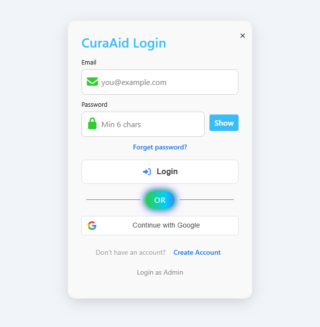

After a successful login you land on **Dashboard**.

Forgot password sends a reset link to the Laravel log file (`backend/storage/logs/laravel.log`) in this demo setup — mail is not sent to a real inbox.

---

## 6. Patient dashboard

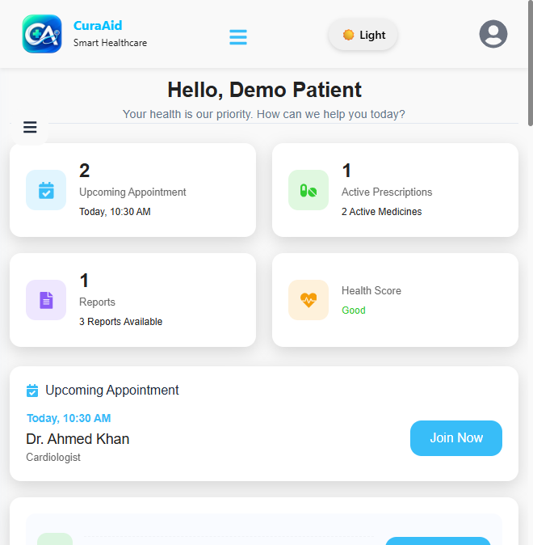

You will see:

- Upcoming appointments, active prescriptions, reports, and a simple health score
- The next appointment with **Join Now** (opens Virtual Clinic)
- A short assistant on the right for common questions
- **My Consultations** (Ongoing / Completed)

Open the **hamburger menu** (☰) for:

| Menu item | What it does |
|-----------|----------------|
| Dashboard | Overview |
| Consultations | Case list |
| Appointments | Book, track, cancel / reschedule |
| Prescriptions | E-prescriptions from completed visits |
| Medical Records | Notes, diagnosis, reports, revisit |
| Profile Settings | Name, photo, password, 2FA, location |

---

## 7. Initial Guidance chatbot (Doctor Finder)

This is **not a diagnosis tool**. It ranks suitable **verified** doctors by specialty, rating, experience, and availability.

Open **Doctor Finder** in the header, or go to `/ai-health-guide`.

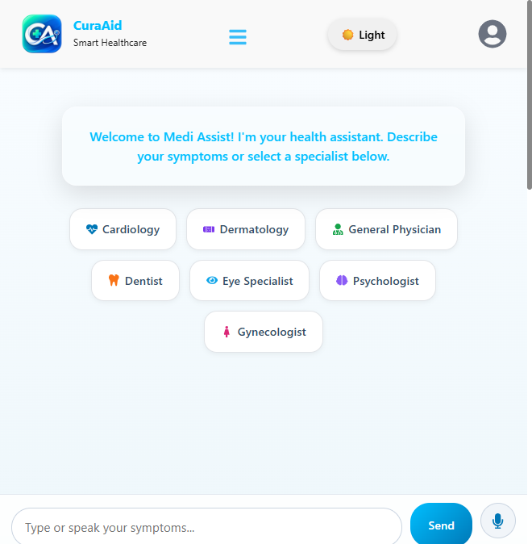

**How to use**

1. Type symptoms (for example: “chest pain and shortness of breath”) **or** tap a specialty chip such as Cardiology.
2. You can also use the microphone to speak.
3. The assistant lists matching doctors. Online doctors appear first.

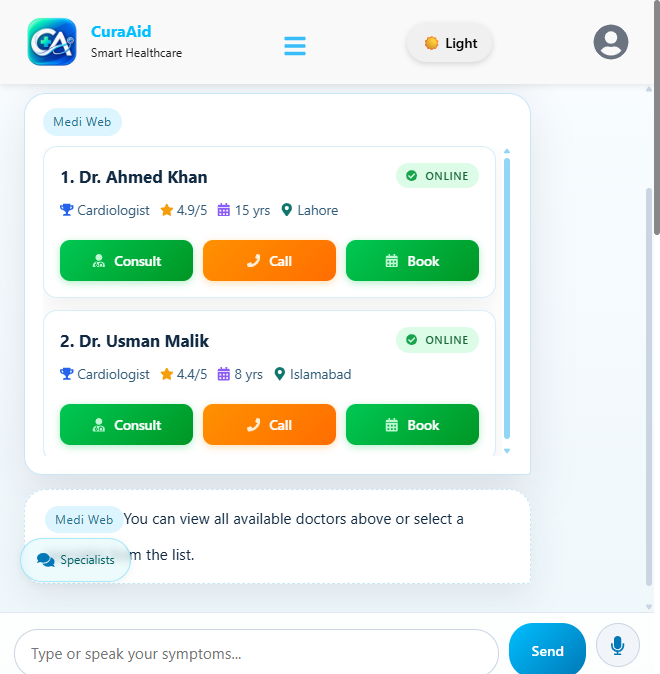

On each doctor card:

- **Consult** — start a text consultation in Virtual Clinic
- **Call** — start an audio consultation
- **Book** — request an appointment (pending doctor approval)

---

## 8. Book an appointment

From **Appointments** click **Book appointment**, or use **Book** on a doctor card.

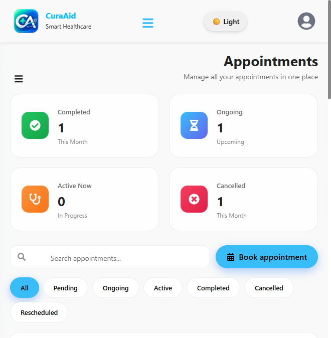

1. Select a doctor.

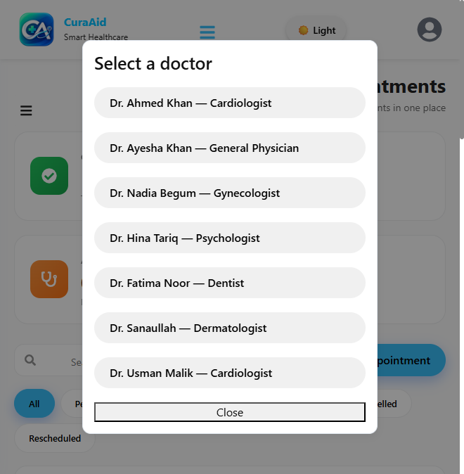

2. Choose date, time, and consultation type:

   - Video
   - Audio
   - Text / Chat
   - Physical visit

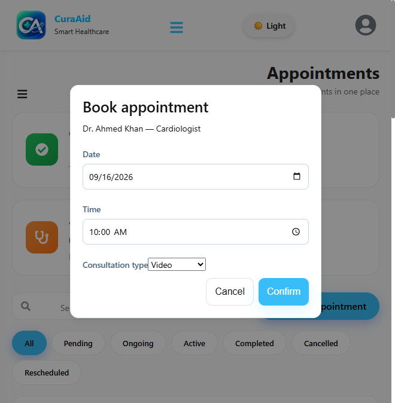

3. Click **Confirm**. The booking is saved as **Pending**. The doctor must **Approve** or **Reject** it. You will see the status under the Pending / Ongoing / Completed tabs.

You can search, cancel, or request a reschedule from the appointment card. The doctor must accept a reschedule.

---

## 9. Consultations and Virtual Clinic

**Consultations** lists every case (ongoing, active, completed, cancelled).

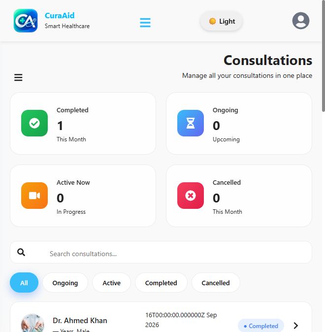

**Join Now** on the dashboard, or open `/clinic`, to enter Virtual Clinic.

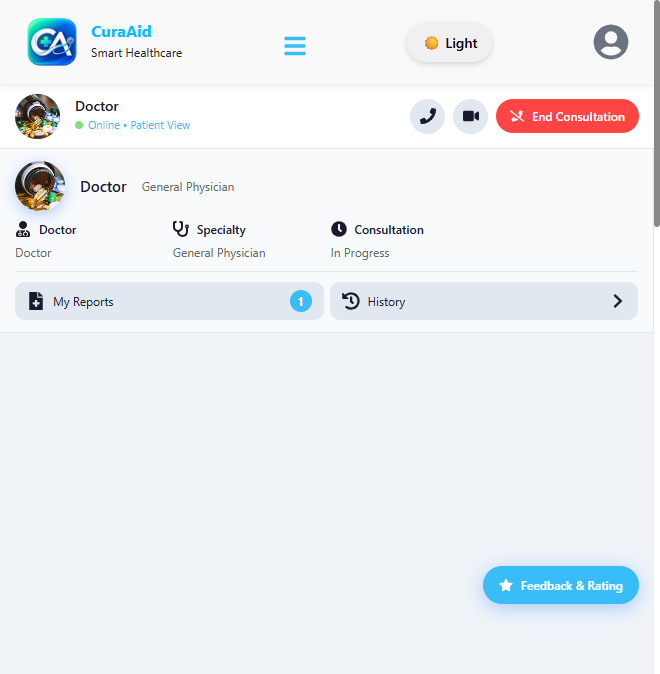

Inside the clinic you can:

- Chat with the doctor
- Start **audio** or **video** (both people must be in the same consultation)
- Attach lab reports and share them with the doctor
- End the consultation
- Leave **Feedback & Rating** when finished

Both sides need a modern browser and microphone/camera permission for calls. The demo uses a public STUN server (no TURN), so some networks may block video.

---

## 10. Prescriptions

After a doctor completes a visit with medicines, they appear under **Prescriptions**.

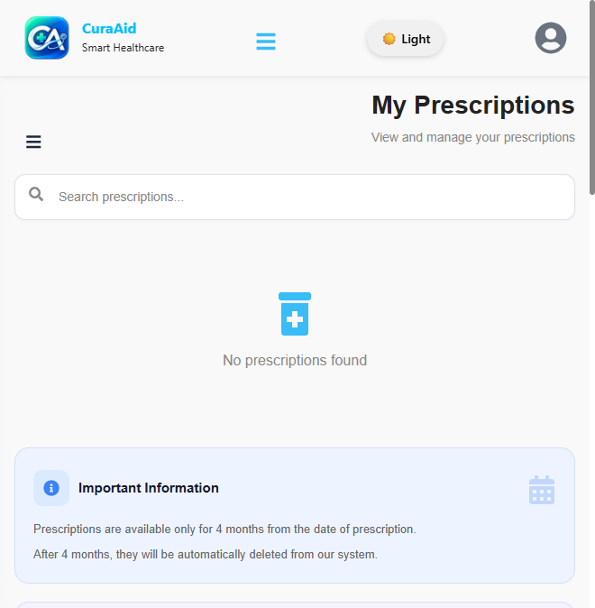

Prescriptions stay in the system for **4 months**, then they are removed. You can search by medicine or doctor name.

Use **Pharmacy → Use my latest e-prescription** to add those medicines to the cart automatically.

---

## 11. Medical records

Open **Medical Records** (`/records`).

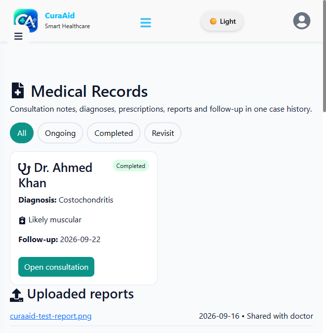

Filter cases:

- **All**
- **Ongoing**
- **Completed**
- **Revisit** (doctor recommended a physical follow-up)

Each card shows diagnosis, notes, follow-up date, and **Open consultation**. Uploaded reports appear at the bottom. Files shared with the doctor are marked accordingly.

---

## 12. Pharmacy, cart, and checkout

Open **Pharmacy**. Search, filter by category / type / illness / brand / price, then click **Add to Cart**.

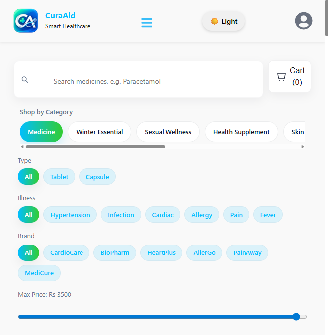

**Add to Cart** is for patients and guests. The cart stays in this browser until you checkout or clear it (refresh does not empty it).

**Two ways medicines enter the cart**

1. Click **Add to Cart** on a product card.
2. Upload a prescription image/PDF, or click **Use my latest e-prescription**. The system matches names against stock (OCR in the browser + catalogue).

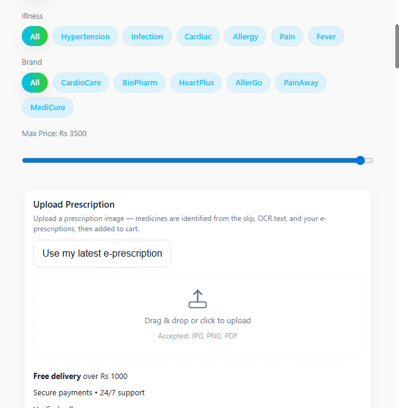

Then:

1. Open **Cart**.
2. Change quantity or remove items.
3. Click **Checkout**.
4. Enter name, phone, and delivery address.
5. Choose **Cash on Delivery** or **Card**.

Card checkout is recorded as **paid** in the database for the demo. There is no live Stripe / PayFast gateway.

If a medicine on a slip is not in stock, it is listed as unavailable and is **not** added to the cart.

---

## 13. Profile settings

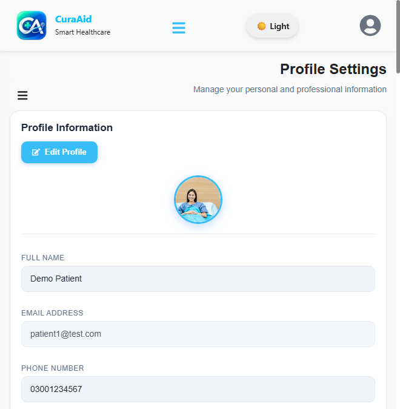

You can:

- Edit name, phone, gender, date of birth, blood group
- Change avatar
- Change password
- Turn two-factor authentication on or off
- Set language, region, and map address

---

## 14. Feedback and About

- **Feedback** (`/feedback`) — send a message to the platform. Logged-in name and email are filled for you.
- **About Us** (`/about`) — mission, team, and links into guidance / pharmacy.

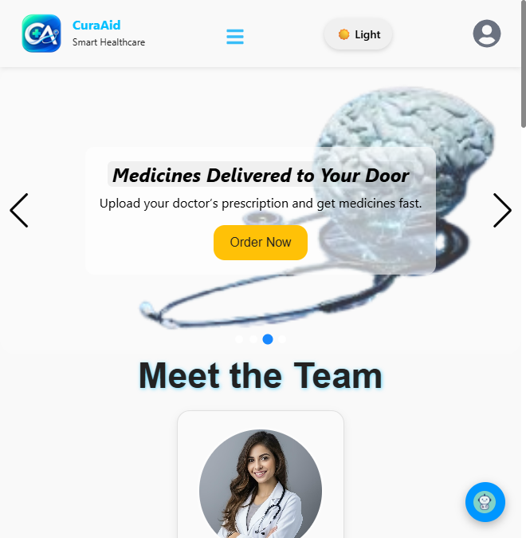

You may also rate a doctor after a consultation from Virtual Clinic (**Feedback & Rating**).

---

## 15. Doctor workflow (if you registered as a doctor)

Log in with a doctor account (for example `doctor1@test.com`). The sidebar adds extra items.

### 15.1 Dashboard

Shows today’s consultations, upcoming appointments, patient count, rating, schedule, and weekly analytics.

### 15.2 Availability

**Availability** sets weekly slots and **max appointments per day**. When the daily cap is reached, new patient bookings for that date are rejected.

### 15.3 Appointments

Pending requests from patients appear here. Open a request and:

- **Approve** — status becomes scheduled
- **Reject** — optional reason; patient sees it as not approved

You can also handle reschedule approve / reject.

### 15.4 Consultations / Virtual Clinic

Start the visit, chat, audio/video, write notes, diagnosis, treatment, and an **e-prescription** (medicine name, dosage, frequency, duration). You may recommend a **physical revisit**. Completing the visit moves the case to Completed and creates the patient’s prescription record.

### 15.5 Patients, prescriptions, medical records

Your patient list is built from appointment and consultation history. Prescriptions and records match what the patient sees for those visits.

### 15.6 New doctor verification

Until an admin approves your documents on **Documents**, you will not appear in the public doctor list or chatbot ranking.

---

## 16. Honest limits (demo)

- **Not a diagnosis.** The chatbot only suggests specialists.
- **Card payment** is simulated (order stored as paid).
- **Video/audio** needs both users online in the same consultation; some NATs block WebRTC.
- **OCR** loads Tesseract.js from a CDN the first time you upload a prescription image.
- **Emergency:** the UI mentions 24/7 help — in this FYP build that is informational, not a live ambulance dispatch.

---

## 17. Quick reference — patient URLs

| Page | URL |
|------|-----|
| Home | `/` |
| Login | `/login` |
| Signup | `/signup` |
| Initial Guidance | `/ai-health-guide` |
| Pharmacy | `/pharmacy` |
| Dashboard | `/dashboard` |
| Appointments | `/appointments` |
| Consultations | `/consultations` |
| Virtual Clinic | `/clinic` |
| Prescriptions | `/prescriptions` |
| Medical records | `/records` |
| Settings | `/settings` |
| Feedback | `/feedback` |
